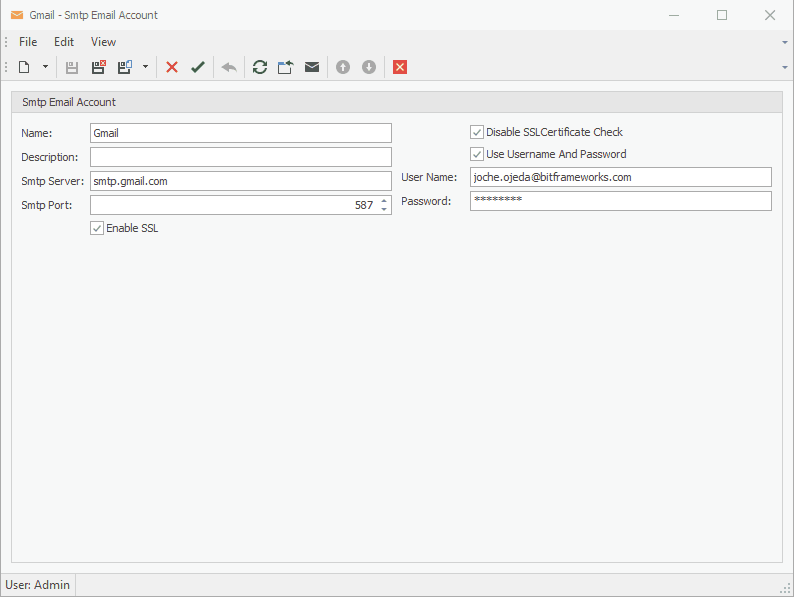
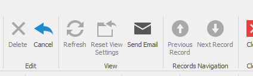


### Ultra Email Module

This module allows you to create and use smtp email accounts inside of your XAF application

### Setup

- Add to your agnostic module project the [nuget package](https://nuget.bitframeworks.com/feeds/main/Ultra.Email/19.1.5.1) from https://nuget.bitframeworks.com/nuget/main/ that matches your current version of XAF

	With the Nuget.exe Client: From the command line, run the following command:
	```
	nuget install Ultra.Email -Version 19.1.5.1 -Source https://nuget.bitframeworks.com/nuget/main/
	```

	To install Ultra.UniversalSearch from the Package Manager Console within Visual Studio, run the following command:
	```
	Install-Package Ultra.UniversalSearch -Version 19.1.5.1 -Source https://nuget.bitframeworks.com/nuget/main/
	```

- Add the module to the require modules (in Module.Designer.cs or Module.Designer.vb) as shown below

### C#
```
private void InitializeComponent()
{		
	this.RequiredModuleTypes.Add(typeof(Ultra.Email.EmailModule));
}
```
### Vb.Net
```
Private Sub InitializeComponent()
	Me.RequiredModuleTypes.Add(GetType(Ultra.Email.EmailModule))
End Sub
```

### Usage

The first step is to navigate to the Smtp EmailA ccount and create at least one account, you will need the following information from your STMP server

- SmtpServer: the domain or ip address of your STMP server
- SmtpPort: the port for your STMP server
- EnableSSL: enable or disable SSL connection to the server, if you enable SSL you probably need to change the port number
- DisableSSLCertificateCheck: Use this if you are using XAF web and you are having troubles connection to an SMTP server that requires SSL,THIS WILL MAKE YOUR CONNECTION NOT SECURE PLEASE USE WISELY
- UseUsernameAndPassword: your SMTP server might require you to login, use this parameter to send the username and password to the server
- UserName: the username used to login 
- Password: the password used to login


After entering all the necessary configuracion for your STMP server you can test the connection using the "Send Test Email" Action




If you want to be able to send an email directly from a detalview or listview you need to implement the interface [IBoToEmail](https://github.com/egarim/Ultra/blob/master/Ultra.Email/IBoToEmail.cs) as shown below


### C#
```
[DefaultClassOptions]
[NavigationItem("Email Module Demo")]
public class EmailObject : BaseObject, IBoToEmail
{
	...
	public string GetSubject()
	{
		return this.Subject;
	}

	public string GetBody()
	{
		return this.Body;
	}

	public string GetTo()
	{
		return this.To;
	}

	public List<Tuple<string, MemoryStream, ContentType>> GetAttachments()
	{
		return null;
	}

	public SmtpEmailAccount GetEmailAccount()
	{
		return this.Session.FindObject<SmtpEmailAccount>(new BinaryOperator("Name", "Gmail"));
	}

	public string GetCC()
	{
		return this.CC;
	}

	public string GetBCC()
	{
		return this.BCC;
	}
}
```
### Vb.Net
```
<DefaultClassOptions>
<NavigationItem("Email Module Demo")>
Public Class EmailObject
	Inherits BaseObject
	Implements IBoToEmail

	...
	Public Function GetSubject() As String
		Return Me.Subject
	End Function

	Public Function GetBody() As String
		Return Me.Body
	End Function

	Public Function GetTo() As String
		Return Me.[To]
	End Function

	Public Function GetAttachments() As List(Of Tuple(Of String, MemoryStream, ContentType))
		Return Nothing
	End Function

	Public Function GetEmailAccount() As SmtpEmailAccount
		Return Me.Session.FindObject(Of SmtpEmailAccount)(New BinaryOperator("Name", "Gmail"))
	End Function

	Public Function GetCC() As String
		Return Me.CC
	End Function

	Public Function GetBCC() As String
		Return Me.BCC
	End Function
End Class

```

When you are implementing the interface, make sure to return string.empty or null for the CC or BCC paramaters if you don't want to use them
otherwise you might get an exception

After you have implented the interface the "Send Email" action will appear in your views



If you want to use the SMTP email accounts from code, there are 2 ways of doing it

- If you want to send emails and display the result you can use SmtpEmailAccountController.XafSendEmail
- If you want to send emails and NOT display the result you can use SmtpEmailAccountController.SendEmailSilently

### Debuging the connection to the SMPT server

Sometimes there are problems connecting to the SMTP server, to debug the connection you should enable error logging in XAF app or web config as shown below


```xml
  <system.diagnostics>
	<switches>
	  <!-- Use the one of predefined values: 0-Off, 1-Errors, 2-Warnings, 3-Info, 4-Verbose. The default value is 3. -->
	  <add name="eXpressAppFramework" value="3"/>
	  <!--
	  <add name="XPO" value="3" />
	  -->
	</switches>
  </system.diagnostics>
```

To locate the log of the email module search for the entry "Sending email", below this entry you will find the parameters used to send the email and any exception information if an exception happened
